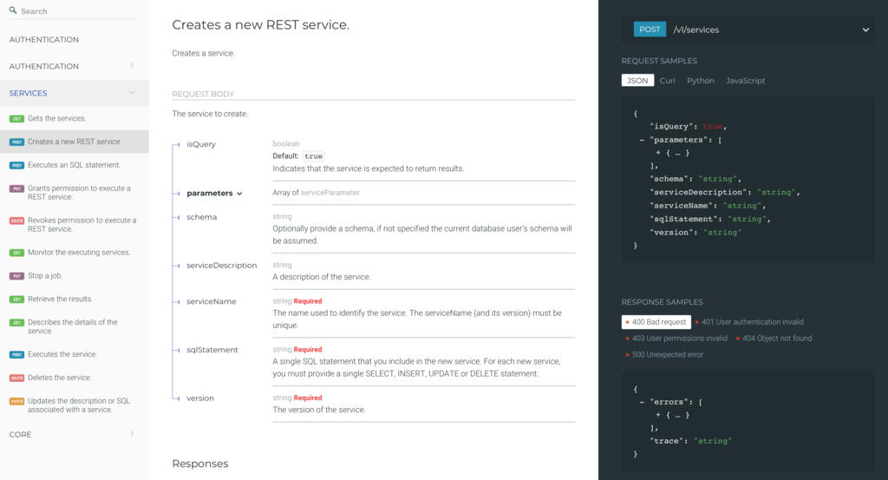
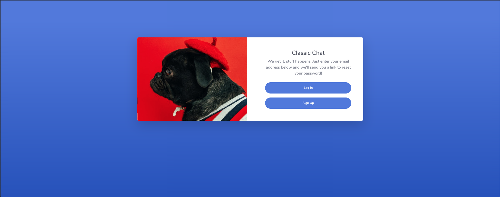

# Clasic Chat For Db2Rest Service

This application is a simple group messaging app that is similar to the basic functionality to Slack and other group messaging apps. This application utilizes the power or Db2 and it's REST service. The application's features includes:

* User Login/Signup
* Create Direct Message
* Create Group Messsage
* Toggle Beween Different Messages
* Send Messages
* Real-Time Messages 

All the features use one or more REST API services. This documentation will go through the entire pipeline of creating this application. The steps are:

* Installing and Setup DB2 Rest Service
* Dowloading Project's Code
* Creating Database Schema
* Creating REST APIs
* Setting Up Configuration Files
* Run Application

Prerequisites For This Project:

* Docker (@version 19.0.0 and above)
* NodeJS and NPM (current stable version)
* Angular CLI (run command `npm install -g @angular/cli`) 
* Jupyter Notebook

## Installing and Setup DB2 Rest Service 

One important thing to note for this step is that this project was created before the Db2 Rest Service became public. So beware that some of the instructions of commands may not be the same when this becomes public. The instructions for this step are for when the DB2 Rest Service is not public yet.

### Install and Setup Db2 on Docker

The first thing we have to do is get access to the repository where the docker image is stored. You need access since it is still in the developer stage. To access the REST services for Db2 internally, you need to download the common container. Email [Aaron](acoady@ca.ibm.com) Coady or [Dan Snoddy](dsnoddy@ca.ibm.com) to request access to the `ibmdashdb/develop` repository with your docker username or use a functional ID which has this access. 

Once you have access, login into your Docker account via terminal:

```
docker login -u <username>
```

Pull down one of the following builds:

```
Intel Build:> docker pull ibmdashdb/develop:latest-local-linux
PPCLE64 build: > docker pull ibmdashdb/develop:latest-local-ppcle
```

Run the image and create a container:

```
docker run -d -it --privileged=true --net=host --name=Db2wh -v /mnt/clusterfs:/mnt/bludata0 -v /mnt/clusterfs:/mnt/blumeta0 -v /mnt/bludrmqdata:/mnt/bludrmqdata -v /mnt/bludrdb2data:/mnt/bludrdb2data ibmdashdb/develop:<insert tag pulled above>
```

Set your new password (don't need to know your old password):

```
docker exec -it Db2wh setpass password
```


### Activate and Initalize the REST Service

In order to activate the REST service and make it available, use:

```
docker exec -it [name] manage_features --name dbrest --activate
```

where [name] is the name of the container. For example, on IIAS the default container name is Db2wh.

To check whether the REST service is activated, use:

```
docker exec -it [name] manage_features --name dbrest --status
```

Before you can query and create new services, you must initialize the system by creating the REST service metadata table:

```
docker exec [name] /opt/ibm/dbrest/scripts/db2rest-setup.sh <hostname> <databaseName> <port> <isSSLConnection> <schema> <username> <password>
```

where:

| **Parameter Name**        | **Description**           |
| ------------- |:-------------:| 
| hostname      | the hostname of the database | 
|databaseName      | the name of the database (e.g. BLUDB)      |  
| port | the database listener port (e.g. 50001)      |  
| isSSLConnection | indicates whether the port identifies an SSL connection (Y) or not (N)      |  
| schema | the schema for the metadata table (e.g. BLUADMIN)      |  
| username | the username under which the metadata table will be created      |  
| password | the password to connect to the database      |  

If you used the commands given in this runbook then the credentails are:

1. hostname - localhost or actual url link 
2. databaseName - BLUDB
3. port - 50001
4. isSSLConnection - Y
5. schema - BLUADMIN
6. username - bluadmin
7. password - password


This entire set will take 15-20min so don't worry if it takes a really long time to run all these commands. Once all these commands have completed and take a look at the REST Service documentation here:

```
https://[serverHostname]:50050/docs
```

Sample documentation looks like:




## Dowloading Project's Code

Download the projects code:

```
git clone https://github.com/rohithravin/Classic-Chat.git
```


## Creating Database Schema

The next thing we have to do is create to the Database Schema for this application. All that is needed is to run the jupyter notebook `notebooks/Create Database Schema.ipynb`. Replace the `<>` with your database credentials and run each code block of the notebook except for the last two. One of the code blocks lists all the tables created in your database. You should have 4 tables created in total.

## Creating REST APIs

The next thing we have to do is create to the Database Schema for this application. All that is needed is to run the jupyter notebook `notebooks/Create REST API Services.ipynb`. Replace the `<>` with your database credentials and run each code block of the notebook except for the last one. One of the code blocks lists all the services/apis created in your database. You should have 12 services created in total.

## Setting Up Configuration Files

The next thing we need to do is configure our project's code to connect to your specific database instance. 

There are two files we need to configure, one is for the nodejs server to talk to the database. Another is for the Angular app to talk to the nodejs server.

### Configure NodeJs Server

Copy the local `env.sample file` located in `classic-chat-server/` and rename it `.env`:

```
cp env.sample .env
```

Update the .env file with the Db2 Database credentials.

```
# Copy this file to .env and replace the credentials with
# your own before starting the app.

REST_URL=<REST_URL>
DB_DATABASE=<DB_DATABASE>
DB_HOSTNAME=<DB_HOSTNAME>
DB_PORT=<DB_PORT>
DB_UID=<DB_UID>
DB_PWD=<DB_PWD>
```

### Configure Angular App

Enter the NodeJs Server host url in the `classic-chat-app/chat-app-client/src/enviroments/enviroment.ts`.

If your NodeJS Server is running on the same machine as the Angular then the replace `<NODE_HOST>` with `http://localhost:8887/`

```
// This file can be replaced during build by using the `fileReplacements` array.
// `ng build --prod` replaces `environment.ts` with `environment.prod.ts`.
// The list of file replacements can be found in `angular.json`.

export const environment = {
  production: false,
  NODE_HOST: <NODE_HOST>
};
```

## Run Application

Once all these steps are successfully done it is time to run our application. Open two terminals, one for the Angular App and the other for the NodeJS Server. 

On one terminal:

```
# run these commands in classic-chat-app/chat-app-client/ folder
npm install
ng serve --open
```

On the other terminal:

```
# run these commands in classic-chat-server/
npm start
```

It should look like this:



## Special Notes:

The NodeJS Server retrieves a token from the database to run API calls every 5 minutes. So once you run the NodeJS Server, wait 5-10mins before running the Angular App.

@author Rohith Ravindranath